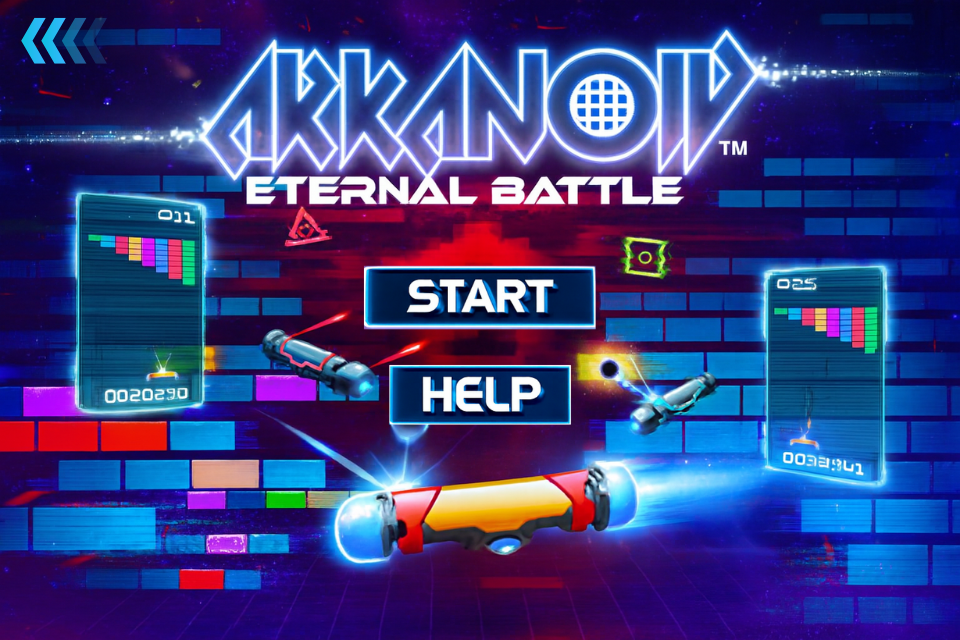

# ARKANOID – OOP PROJECT

## Member
MSSV: 24020134 — Name: Nguyễn Duy Hiệu  
MSSV: 24020107 — Name: Trần Thùy Dương  
MSSV: 24020044 — Name: Nguyễn Hữu Cảnh  
MSSV: 24020350 — Name: Đặng Xuân Tùng 

## 🎯 Mục tiêu  
Phá vỡ tất cả các viên gạch bằng cách điều khiển thanh **paddle** đỡ bóng sao cho bóng không rơi xuống.  
Game được viết bằng **JavaFX**, tuân theo mô hình **MVC**.

---

## 🕹️ Cách chơi  
| Hành động | Phím |
|------------|------| 
| Di chuyển sang trái | ←|
| Di chuyển sang phải | →| 
| Tạm dừng / Tiếp tục | P |
---

## 🧱 Brick
| Hình ảnh | Loại gạch | Độ bền |
|-----------|------------|--------|
|  | **Gạch thường** | 1 lần chạm |
|  | **Gạch cứng** | 2 lần chạm |
|  | **Gạch siêu cứng** | 3 lần chạm|
|  | **Gạch không phá được** | Không thể phá |
---

## 💥 Power-ups  

| Hình ảnh | Tên | Hiệu ứng |
|-----------|------|----------|
|  | **Expand Paddle** | Làm **rộng paddle**  trong một khoảng thời gian nhất định |
|  | **Fast Ball** | Bóng **di chuyển nhanh hơn** |
|  | **Extra Life** | Thêm **1 mạng** |
|  | **Multi Ball** | Tạo thêm nhiều bóng cùng lúc |

---

## ❤️ Mạng sống  
- Người chơi bắt đầu với **3 mạng**.  
- Mỗi khi bóng rơi xuống dưới, mất 1 mạng.  
- Khi hết mạng: **Game Over**.

---

## 🏆 Thắng cuộc  
Phá **toàn bộ gạch có thể phá** để qua màn hoặc chiến thắng trò chơi.

---

## 🎨 Giao diện menu  

  
*Giao diện menu chính của game*  

## 🎮 Giao diện gameplay

| Map 1 | Map 2 | Map 3 | Map 4 |
|-------|-------|-------|-------|
|  |  |  |  |
